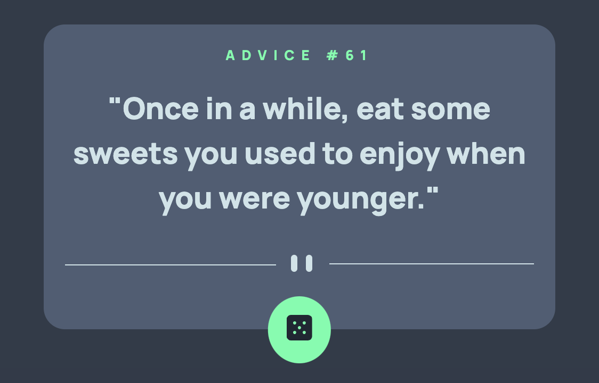

# Advice Generator App Solution ( ◡̀_◡́)ᕤ

This is a solution to the [Advice generator app challenge on Frontend Mentor](https://www.frontendmentor.io/challenges/advice-generator-app-QdUG-13db). Frontend Mentor challenges help you improve your coding skills by building realistic projects.

## Table of contents

- [Overview](#overview)
  - [The challenge](#the-challenge)
  - [Screenshot](#screenshot)
  - [Links](#links)
- [My process](#my-process)
  - [Built with](#built-with)
  - [What I learned](#what-i-learned)
- [Author](#author)

## Overview

### The challenge

Users should be able to:

- View the optimal layout for the app depending on their device's screen size
- See hover states for all interactive elements on the page
- Generate a new piece of advice by clicking the dice icon

### Screenshot

### Links

- Solution URL: [Add solution URL here](https://your-solution-url.com)
- Live Site URL: [Add live site URL here](https://your-live-site-url.com)

## My process

### Built with

- HTML
- CSS custom properties
- Flexbox
- [React](https://reactjs.org/) - JS library

### What I learned

By completing this challenge, I got to resharpen my HTML, CSS, and Javascript skills after a while. This project in particular taught me how to make webapp elements look more interesting by using transitions.

## Author

- Frontend Mentor - [@brishar0n](https://www.frontendmentor.io/profile/brishar0n)
